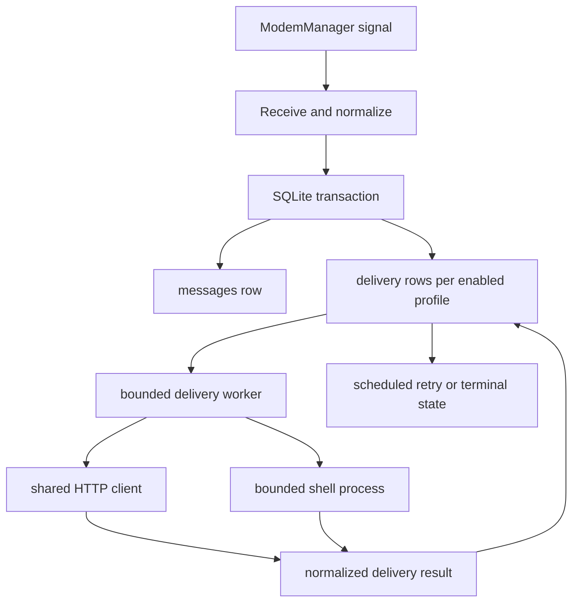
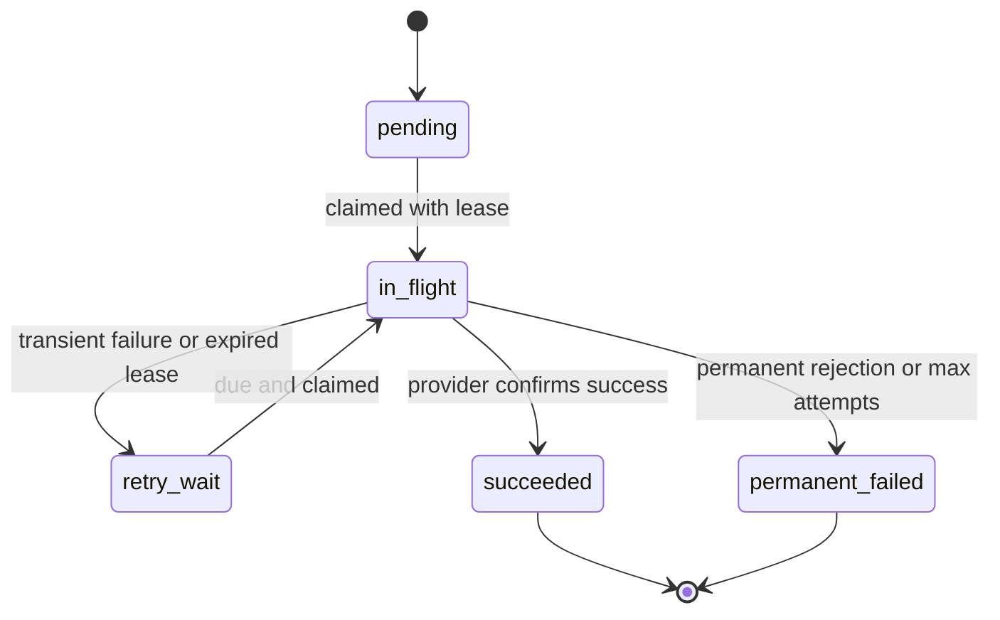

# Long-Running SMS Relay Hardening - Plan

## Goal Capsule

- **Objective:** Make `sms-relayed` safe for unattended, months-long operation on an ImmortalWrt aarch64 board with roughly 392 MB RAM and no swap, without losing SMS forwarding when ModemManager, provider networks, or helper processes misbehave.
- **Authority:** This plan and `AGENTS.md` define the implementation boundary. The existing modem health contract in `docs/superpowers/specs/2026-07-09-modem-health-design.md` remains authoritative where this plan does not explicitly refine runtime receive behavior.
- **Execution profile:** Implement in dependency order and stop at the review gates after U2, U4, U8, and U9. Each gate should be reviewable without requiring later units.
- **Stop conditions:** Stop and request a design decision if stable modem identity cannot be obtained without selecting by list order, if durable retry requires changing existing provider semantics beyond the states defined here, or if an implementation needs to log phone numbers, SMS bodies, tokens, or raw modem output.
- **Tail ownership:** The final executor produces the soak-test evidence and operational notes. Code review and acceptance remain separate from implementation.

---

## Product Contract

### Summary

The service must keep receiving, persisting, and forwarding SMS under normal long-running operation and recover from bounded external failures without unbounded memory, process, file-descriptor, or database-query growth.

### Problem Frame

The deployed process currently has a healthy baseline: after roughly 24 hours it used about 8.1 MB RSS, 1.0 MB anonymous memory, five threads, and twelve file descriptors, with near-zero system load and no observed growth during a short sample.

The risk is therefore not an active idle leak.
The risk is failure-triggered resource growth and silent loss of service: external calls can hold the only D-Bus receive loop, timed-out `mmcli` processes can survive, a re-enumerated modem can leave a live process subscribed to a stale object path, failed deliveries are not retried, and several API paths scale with total history size.

### Requirements

**Receive continuity and delivery reliability**

- R1. The receive monitor recovers after ModemManager restarts or the configured modem re-enumerates, without silently switching to unrelated hardware.
- R2. Persisting an inbound SMS is independent from provider HTTP or shell latency, so a stalled delivery cannot stop D-Bus signal consumption.
- R3. Every external HTTP, shell, D-Bus method, and `mmcli` operation has a finite deadline and releases its resources on expiry.
- R4. Each enabled forwarding profile has a durable delivery state, bounded retry policy, and terminal failure state; provider-level rejection must not be recorded as success.
- R5. Restarting the service recovers eligible incomplete deliveries without dropping them or launching an unbounded retry burst.

**Bounded resources and correct long-history behavior**

- R6. Timed-out child processes are terminated and reaped; normal steady state has no accumulating `mmcli` or shell children.
- R7. Message export does not materialize the entire database or duplicate full-history queries, and its peak memory is bounded independently of row count.
- R8. Conversation summaries remain complete and counts remain exact after more than 500 messages.
- R9. Expired web sessions are reclaimed and the session store has an explicit upper bound.
- R10. Concurrent health requests share one modem probe per refresh window instead of spawning parallel `mmcli` trees.
- R11. Opening a conversation with many unread messages uses a bounded number of API requests and refreshes.
- R12. Message retention is configurable, disabled by default for backward compatibility, and deletes in bounded batches when enabled.

**Operational proof**

- R13. The repository contains a repeatable constrained-device soak procedure that records RSS/PSS, CPU time, threads, file descriptors, child processes, database size, and delivery outcomes.
- R14. The service meets the measurable resource and recovery thresholds in the Verification Contract on the target aarch64 board.

### Acceptance Examples

- AE1. Given the monitored modem was `/Modem/0`, when ModemManager restarts and the same physical modem returns as `/Modem/1`, then reception resumes using verified stable hardware identity and the configured path is not rewritten.
- AE2. Given one provider endpoint accepts a connection but never responds, when two SMS arrive, then both are persisted promptly, the receive loop continues, and the blocked attempt reaches retry state after its deadline.
- AE3. Given `mmcli` ignores termination progress and exceeds five seconds, when the timeout fires, then the API returns a normalized timeout and the child PID no longer exists after cleanup.
- AE4. Given all providers are unavailable across a service restart, when they recover later, then persisted eligible deliveries resume with bounded backoff and reach success without a retry storm.
- AE5. Given 100,000 stored messages, when CSV or JSON export runs, then output is streamed and peak RSS stays within the threshold in the Verification Contract.
- AE6. Given a conversation has messages older than the newest 500 global records, when conversation summaries load, then that conversation is present and its total and unread counts are exact.
- AE7. Given 100 simultaneous requests hit an expired health cache, when the modem probe begins, then the runner observes one refresh operation and all callers share its result or bounded stale result.
- AE8. Given 50 unread messages in one conversation, when the user opens it, then the frontend performs one bulk read mutation and a bounded refresh rather than one mutation per message.

### Success Criteria

- No silent receive outage after the tested ModemManager restart and path re-enumeration sequence.
- No orphan helper processes after any timeout test.
- No unbounded in-memory collection remains on export, sessions, health refresh, or delivery scheduling paths.
- No persisted inbound message is treated as successfully forwarded unless each enabled profile has an explicit success result.
- Existing send, auth, config, health, modem action, message list, and SSE behavior continues to pass its regression suite.

### Scope Boundaries

**In scope**

- D-Bus receive lifecycle and modem identity resolution.
- Provider and shell execution deadlines.
- Durable per-profile delivery state and retry scheduling in SQLite.
- Bounded export, exact conversation aggregation, session cleanup, health single-flight, and frontend read batching.
- Optional retention and target-device soak tooling.

**Out of scope**

- Replacing SQLite, Tokio, Axum, zbus, reqwest, or the existing frontend stack.
- Adding new forwarding providers or redesigning provider message formats.
- Persistently rewriting `app.modem_path` after path drift.
- Automatically choosing the first or only modem, or selecting a modem by list order.
- Exactly-once delivery across external providers that do not supply idempotency keys. Ambiguous network outcomes use at-least-once recovery and may produce a duplicate; they must never be silently discarded.
- Web UI redesign, service-manager replacement, bearer management, cellular WAN management, or unrelated Clippy cleanup.

---

## Planning Contract

### Key Technical Decisions

- KTD1. **Persist before dispatch.** The D-Bus path persists the inbound message and creates per-profile delivery records in one SQLite transaction, then signals a worker. It never awaits provider delivery.
- KTD2. **Use a durable bounded worker, not one task per SMS.** A fixed worker count claims due delivery rows in bounded batches. SQLite remains the source of truth across process restarts; an in-memory notification only reduces pickup latency.
- KTD3. **Model explicit delivery states.** Use `pending`, `in_flight`, `retry_wait`, `succeeded`, and `permanent_failed`, with attempt count, next-attempt time, last normalized error, and a lease timestamp. A unique message/profile key prevents duplicate rows.
- KTD4. **Recover expired leases.** On startup and periodically, stale `in_flight` rows return to `retry_wait`. Retry delay is capped exponential backoff with jitter and a global concurrency limit.
- KTD5. **Treat provider business errors as errors.** HTTP success alone is insufficient. Each adapter maps provider response semantics into success, transient failure, or permanent failure without logging secrets or SMS content.
- KTD6. **Reuse one deadline-configured HTTP client.** Configure connect and total request timeouts once and inject the client into provider adapters. Shell and `mmcli` processes use independent configurable deadlines plus kill-and-reap cleanup.
- KTD7. **Separate configured identity from runtime path.** Resolve `EquipmentIdentifier` as the preferred stable value and `DeviceIdentifier` as the fallback, never SIM, operator, port, count, or list order. Persist only a domain-separated SHA-256 fingerprint in local runtime state so a service restart can match candidates without storing the raw identifier. Never log or expose the raw value or fingerprint. Enroll the fingerprint only when the configured path resolves unambiguously; rebind reception only when exactly one candidate fingerprint matches. Keep `app.modem_path` unchanged and keep modem actions subject to the existing configured-target rules.
- KTD8. **Fail closed on ambiguous modem identity.** If stable identity is unavailable or multiple candidates match, report degraded/error health and wait for operator action rather than selecting by order.
- KTD9. **Push synchronous SQLite work off async request workers when it can be long.** Keep the current storage abstraction, but execute exports, aggregation, retention, and delivery claims through a blocking boundary or dedicated database worker. Do not introduce a new database framework solely for this plan.
- KTD10. **Stream history.** JSON and CSV export each execute one query and serialize bounded batches directly to the response. Client disconnect cancels the producer and releases the SQLite statement.
- KTD11. **Preserve history by default.** Retention is opt-in. When configured, it deletes only terminal/old rows in bounded batches and never removes a message with a non-terminal delivery.
- KTD12. **Coalesce rather than poll harder.** Health refresh uses single-flight and bounded stale data. Frontend SSE handling coalesces refreshes and bulk-marks a conversation read.
- KTD13. **Bind retries to the profile reference captured at receipt.** New profiles do not receive historical messages automatically. A removed or renamed profile causes its existing non-terminal rows to become `permanent_failed` with a safe `profile_missing` code; provider secrets and full configuration snapshots are never stored in SQLite.

### Initial Runtime Limits

These are conservative starting defaults for the target LTE board. They remain configurable and must be validated by U9 rather than silently tuned during implementation.

| Limit | Initial default | Constraint |
|---|---:|---|
| HTTP connect deadline | 10 seconds | Must be lower than total request deadline |
| Provider total request deadline | 30 seconds | Covers connect, request, response body, and provider JSON parsing |
| Shell execution deadline | 30 seconds | Timeout must kill and reap the child |
| `mmcli` deadline | Existing 5 seconds | Preserve the modem-health design contract |
| Delivery worker concurrency | 2 | Global across all profiles |
| Delivery claim batch | 16 rows | Must not spawn one task per claimed row |
| Delivery lease | 90 seconds | Must exceed the default provider deadline and cleanup margin |
| Retry initial delay | 30 seconds | Apply jitter |
| Retry maximum delay | 1 hour | Apply jitter and avoid synchronized recovery |
| Retry maximum age | 24 hours | Then enter `permanent_failed`; allow an operator-triggered future retry as deferred work |
| Session store maximum | 256 entries | Prune expired entries before capacity eviction |
| Health stale-result maximum | 30 seconds | Only while one refresh is already in flight |
| Retention | Disabled | No upgrade may delete existing history implicitly |
| Retention batch | 500 rows | Commit between batches and yield to normal work |
| Frontend event coalescing window | 100 milliseconds | Preserve prompt visible updates while collapsing bursts |

### High-Level Technical Design

The following diagrams are directional. Implementers must verify zbus and rusqlite lifecycle details against the versions pinned by `Cargo.lock`.





```mermaid
sequenceDiagram
  participant MM as ModemManager
  participant MON as Receive monitor
  participant RES as Identity resolver
  participant DB as SQLite
  MM-->>MON: owner disappears or object removed
  MON->>RES: enter recovery with bounded backoff
  MM-->>RES: objects return with new paths
  RES->>RES: match stable identity fingerprint
  alt exactly one verified match
    RES-->>MON: bind runtime path
    MON->>DB: continue capture
  else missing or ambiguous identity
    RES-->>MON: remain degraded; no auto-selection
  end
```

### Sequencing and Review Gates

1. **Containment:** U1 and U2 stop helper-process and external-call resource leaks without changing delivery persistence. Review Gate A follows U2.
2. **Core reliability:** U3 and U4 introduce receive recovery and durable delivery. Review Gate B follows U4 and must validate schema/state-machine semantics before scale work begins.
3. **Bounded history and API load:** U5 through U8 address database, session, health, and frontend growth. Review Gate C follows U8.
4. **Operational proof:** U9 runs target-device validation and records evidence. Review Gate D is the release decision.

### Assumptions

- The deployed appliance normally has one configured physical modem, but the implementation must remain safe when multiple modem objects exist.
- ModemManager exposes `EquipmentIdentifier` or `DeviceIdentifier` consistently enough to fingerprint the configured modem across object-path changes. Raw values remain process-local and redacted; only the domain-separated fingerprint may persist. If no safe equality comparison is available, automatic rebind remains disabled and becomes a surfaced operator action.
- Delivery retries are more important than avoiding every possible duplicate after an ambiguous timeout.
- Retention defaults to disabled so upgrading cannot delete existing history without operator configuration.
- The existing approximately 8.1 MB RSS, five threads, and twelve FDs are the initial target-board baseline, not a hard ABI contract.

### Risks and Mitigations

| Risk | Impact | Mitigation |
|---|---|---|
| Wrong modem rebound after enumeration | SMS from unrelated hardware may be forwarded | Require stable identity equality; never select by count or order; test multiple candidates |
| Retry after ambiguous provider timeout | Duplicate notification | Record attempt history, use provider idempotency support where available, document at-least-once semantics |
| SQLite migration interrupted | Service startup failure or delivery state inconsistency | Use transactional migration, schema version checks, and migration tests from populated prior schema |
| Retry storm after network recovery | CPU, network, and provider-rate spike | Global concurrency cap, capped exponential backoff, jitter, and bounded claim batches |
| Timeout too aggressive on slow LTE | False delivery failures | Make deadlines configurable with conservative defaults and cover slow-but-successful responses |
| Retention removes undelivered data | Permanent loss | Exclude non-terminal deliveries and keep retention disabled by default |
| Export holds read lock too long | Writes and inbound persistence stall | Short bounded batches, cancellation on disconnect, and concurrent ingest tests |
| Instrumentation leaks message content | Privacy breach | Metrics and logs use counts, profile identifiers, error codes, and truncated safe diagnostics only |

---

## Implementation Units

### U1. Characterization and failure-injection seams

- **Goal:** Establish deterministic tests for deadlines, process cleanup, delivery results, database scale, and modem lifecycle before changing runtime behavior.
- **Requirements:** R3, R6, R13.
- **Files:** `src/modem.rs`, `src/dbus.rs`, `src/forward/mod.rs`, `src/forward/*.rs`, `src/storage.rs`, `tests/fixtures/`, new focused integration-test modules under `tests/` where process-level behavior is required.
- **Patterns:** Extend the existing `MmcliRunner` seam and introduce equivalent provider/clock/process seams only where a deterministic test cannot use a local fixture server or short-lived child.
- **Approach:** Add characterization coverage for current success behavior and failure harnesses for a black-hole HTTP endpoint, a never-ending shell child, an `mmcli` timeout, a populated legacy database, and ModemManager owner/path changes. Keep test helpers free of production secrets and phone numbers.
- **Test scenarios:**
  - A normal provider response preserves the current rendered message and success result.
  - A provider business rejection is distinguishable from transport failure in the test seam.
  - A child that exceeds its deadline exposes whether its PID survives.
  - A database fixture with more than 500 messages reproduces the current conversation truncation.
  - A fixture sequence represents `/Modem/0` disappearing and the same hardware returning as `/Modem/1`.
- **Verification:** The new tests fail for the intended pre-fix reasons and existing 46 Rust tests remain green before behavior changes are introduced.
- **Dependencies:** None.

### U2. Bound all external calls and child lifecycles

- **Goal:** Ensure HTTP, shell, D-Bus method, and `mmcli` work cannot wait forever or leave processes behind.
- **Requirements:** R3, R6, and containment groundwork for R2.
- **Files:** `src/forward/mod.rs`, `src/forward/bark.rs`, `src/forward/dingtalk.rs`, `src/forward/pushplus.rs`, `src/forward/telegram.rs`, `src/forward/wecom.rs`, `src/forward/shell.rs`, `src/modem.rs`, `src/dbus.rs`, `src/config.rs`, `README.md`.
- **Patterns:** Reuse Tokio timeouts, `reqwest::ClientBuilder`, the existing typed config/default/validation conventions, and the `MmcliRunner` abstraction.
- **Approach:** Construct one shared HTTP client with connect and request deadlines; add validated defaults without breaking existing config files. Ensure shell and `mmcli` children are killed and reaped on timeout. Apply finite zbus method deadlines or explicit timeout wrappers at the method-call boundary, while allowing the long-lived signal stream itself to wait normally.
- **Test scenarios:**
  - HTTP connect failure and response stall both finish within the configured bound.
  - A slow response below the deadline still succeeds.
  - Shell timeout returns a normalized error and the child PID disappears.
  - `mmcli` timeout returns `mmcli_timeout` and no child remains.
  - After a provider reaches its deadline, a subsequent test SMS reaches persistence; full independence from provider latency is deferred to U4.
- **Verification:** Targeted timeout tests pass repeatedly without flaky sleeps; process inspection after the suite shows no helper children.
- **Dependencies:** U1.

### U3. Recover the receive monitor across ModemManager lifecycle changes

- **Goal:** Restore SMS reception after ModemManager restart or verified path drift without selecting unrelated hardware.
- **Requirements:** R1, R2.
- **Files:** `src/dbus.rs`, `src/modem.rs`, `src/runtime.rs`, `src/events.rs`, `tests/fixtures/mmcli/` or D-Bus-specific fixtures under `tests/`.
- **Patterns:** Keep the existing configured-path contract for health/actions; reuse modem resolution diagnostics and normalized error codes.
- **Approach:** Add a monitor supervisor that observes ModemManager owner/object lifecycle, enrolls the configured modem's identity fingerprint when safe, and recreates the message subscription with bounded backoff after disconnect. The runtime path may change in memory only after exactly one candidate fingerprint matches. Ambiguous, unavailable, or unenrolled identity leaves the monitor degraded and retrying slowly, with an operator-visible reason.
- **Test scenarios:**
  - Same identity returns on a new path and reception resumes once.
  - A service restart after path drift uses the persisted fingerprint to recover the same modem.
  - A stale configured path with no enrolled fingerprint fails closed and requests operator action.
  - A different identity appears alone and is not selected.
  - Multiple candidate modems do not trigger list-order selection.
  - Repeated ModemManager failures use capped backoff and do not busy-loop.
  - A malformed signal is logged safely and does not terminate the supervisor.
- **Verification:** The lifecycle integration test observes a message after rebind, while wrong/ambiguous identity tests observe no forwarding.
- **Dependencies:** U1, U2.

### U4. Add durable per-profile delivery and bounded retry

- **Goal:** Prevent transient provider outages or restarts from silently losing forwarding attempts.
- **Requirements:** R2, R4, R5.
- **Files:** `src/storage.rs`, `src/message.rs`, `src/runtime.rs`, `src/dbus.rs`, `src/forward/mod.rs`, `src/forward/*.rs`, `src/config.rs`.
- **Patterns:** Follow the existing transactional SQLite migration style and typed profile names from `ChannelProfile`; keep SSE payload compatibility unless a new delivery-status event is demonstrably required.
- **Approach:** Add a `forward_deliveries` table keyed by inbound message and profile identity. Insert message and initial delivery rows atomically. Run a fixed-concurrency scheduler that claims due rows with leases, normalizes adapter outcomes, and applies bounded retry/backoff. Recover expired leases on restart. Return an error from adapters for provider business rejection instead of only logging it.
- **Test scenarios:**
  - Message plus all enabled profile deliveries commit atomically.
  - One profile succeeds while another retries independently.
  - Transient failures progress through retry and eventually succeed.
  - Permanent provider rejection reaches `permanent_failed` without infinite retries.
  - Restart recovers an expired `in_flight` lease exactly once at the row level.
  - A burst larger than the worker concurrency remains queued without spawning one task per row.
  - Migration from the current populated schema preserves all messages.
- **Verification:** Failure-injection tests prove no eligible row disappears, retry concurrency never exceeds its configured cap, and existing inbound message/SSE behavior remains compatible.
- **Dependencies:** U2, U3.

### U5. Move conversation aggregation into bounded SQL

- **Goal:** Return complete, exact conversation summaries regardless of total message history.
- **Requirements:** R8.
- **Files:** `src/storage.rs`, `src/api/messages.rs`, relevant storage/API tests.
- **Patterns:** Retain the current `ConversationSummary` API shape and newest-first ordering.
- **Approach:** Replace the newest-500 in-memory grouping with indexed SQL aggregation for total/unread counts and deterministic last-message selection. Add only the indexes justified by the query plan.
- **Test scenarios:**
  - More than 500 global messages still return older conversations.
  - Total and unread counts are exact across inbound and outbound rows.
  - Equal timestamps use message ID for deterministic last-message ordering.
  - A conversation with zero unread messages reports zero.
  - Query-plan evidence confirms no per-conversation N+1 query.
- **Verification:** Existing conversation API tests pass plus a populated large-history regression test.
- **Dependencies:** U1.

### U6. Stream export and add safe retention

- **Goal:** Bound history-related memory and database growth without deleting data by default.
- **Requirements:** R7, R12, R14.
- **Files:** `src/storage.rs`, `src/api/messages.rs`, `src/config.rs`, `README.md`, export/retention tests.
- **Patterns:** Preserve current CSV columns, JSON message representation, filters, authentication, and content-disposition behavior.
- **Approach:** Give JSON and CSV separate single-query streaming paths with bounded buffers and cancellation. Add optional retention configuration with disabled default, age threshold, bounded batch size, and exclusion of messages with non-terminal deliveries. Run cleanup at low frequency and avoid holding the database mutex across async response writes.
- **Test scenarios:**
  - CSV and JSON output remain schema-compatible for empty and populated data.
  - One export request executes one filtered query.
  - Client cancellation releases the producer and database resources.
  - A 100,000-row export stays within the memory threshold.
  - Disabled retention deletes nothing.
  - Enabled retention deletes only eligible old terminal rows in bounded batches.
  - Non-terminal delivery rows protect their parent message from retention.
- **Verification:** Large-fixture export produces valid output, concurrent inbound insert completes during export, and target-device RSS stays bounded.
- **Dependencies:** U4 for delivery-aware retention; U5 may proceed in parallel before U4 is merged.

### U7. Bound sessions and health-probe concurrency

- **Goal:** Remove the remaining unbounded in-process maps and parallel modem-probe fan-out.
- **Requirements:** R9, R10.
- **Files:** `src/api/auth.rs`, `src/api/health.rs`, `src/modem.rs`, API/modem tests.
- **Patterns:** Reuse `SessionStore`, the existing five-second health cache, and injected `MmcliRunner` call counting.
- **Approach:** Prune expired sessions during normal store operations and enforce an explicit maximum with oldest-expiry eviction. Add single-flight refresh around public modem health; concurrent callers await one refresh or receive a bounded-age stale value. Do not serialize authenticated modem actions behind the health refresh.
- **Test scenarios:**
  - Expired sessions are removed and cannot authenticate.
  - Repeated logins never grow the store beyond its configured maximum.
  - Eviction does not remove a newer session before an older one.
  - One hundred concurrent expired-cache requests invoke one modem status refresh.
  - A failed refresh releases all waiters and permits a later retry.
  - Modem action locking remains independent.
- **Verification:** Deterministic tests inspect store length and runner call count; no test depends on wall-clock sleeps longer than a minimal timeout.
- **Dependencies:** U1, U2.

### U8. Batch read mutations and coalesce frontend refreshes

- **Goal:** Keep UI-generated HTTP, SQLite, and SSE work bounded when a conversation contains many unread messages.
- **Requirements:** R11.
- **Files:** `frontend/src/components/messages/message-console.tsx`, `frontend/src/lib/events.ts`, `src/api/messages.rs`, `src/events.rs`, frontend and API tests.
- **Patterns:** Reuse the existing conversation-read endpoint and EventBus; preserve immediate visible read state.
- **Approach:** Replace per-message read requests with one conversation-level mutation. Emit one batch/conversation event or update local state optimistically, and debounce/coalesce SSE-driven reloads so one logical action causes a bounded number of list queries.
- **Test scenarios:**
  - Opening a conversation with 50 unread rows sends one read mutation.
  - The UI converges to all-read after success.
  - Failure clears the in-flight guard and allows retry.
  - A burst of created/updated/read events triggers at most one refresh per coalescing window.
  - Switching conversations during an in-flight request does not mark the wrong conversation.
- **Verification:** Frontend tests assert request counts and final state; backend tests assert one update operation and one logical event.
- **Dependencies:** U5 for exact summaries; otherwise independent of U6 and U7.

### U9. Target-board soak, fault injection, and operational handoff

- **Goal:** Prove the completed system meets long-running resource and recovery thresholds on the actual ImmortalWrt board.
- **Requirements:** R13, R14.
- **Files:** new `scripts/soak-sms-relayed.sh`, new `docs/operations/long-running-validation.md`, `README.md` only for a concise operator link.
- **Patterns:** Use `/proc`, `ps`, `logread`, service status, and SQLite read-only measurements available on the target. Never print phone numbers, bodies, secrets, or full tokens.
- **Approach:** Provide a read-only sampler and a documented fault matrix covering idle operation, black-hole provider, timed-out child, ModemManager restart/path drift, retry recovery, concurrent health load, and large export. Keep disruptive fault actions out of the sampler; the runbook must identify the target host, require explicit operator acknowledgement, and protect the only production database from destructive tests. Record baseline, sample interval, firmware/kernel, binary version, config redactions, and pass/fail results.
- **Test scenarios:**
  - Twenty-four-hour idle run after warm-up.
  - Repeated HTTP and shell timeout cycles with no surviving children.
  - ModemManager restart and verified same-hardware path drift.
  - Provider outage across process restart followed by recovery.
  - One hundred concurrent health requests at cache expiry.
  - One hundred-thousand-row CSV and JSON export while receiving an SMS.
  - Retention-enabled bounded cleanup on a copied test database, never the only production database.
- **Verification:** All thresholds below pass and the evidence contains no sensitive message or subscriber data.
- **Dependencies:** U2 through U8.

---

## Verification Contract

### Repository Gates

| Gate | Command | Applies to | Pass signal |
|---|---|---|---|
| Rust formatting | `cargo fmt --check` | Every Rust unit | Exit 0 |
| Rust tests | `cargo test` | U1-U7 | All existing and new tests pass |
| Rust lint | `cargo clippy --all-targets` | U1-U7 | Exit 0 and no new warning categories introduced by changed code |
| Frontend check | `pnpm check` from `frontend/` | U8 | Exit 0 |
| Frontend tests | `pnpm test` from `frontend/` | U8 | Request-count and state tests pass |
| Frontend build | `pnpm build` from `frontend/` | U8 | Production bundle builds |
| Working tree audit | `git diff --check` | Every review gate | No whitespace errors |

The current repository has 46 passing Rust tests.
`cargo clippy --all-targets -- -D warnings` is not a valid initial gate because existing dead-code and ordinary Clippy warnings already fail it; this plan requires no new warnings in changed code rather than hiding or expanding that baseline.

### Target-Board Thresholds

| Metric or behavior | Acceptance threshold |
|---|---|
| Idle RSS/PSS after warm-up | No monotonic growth; end-to-start delta at or below 5 MiB across 24 hours |
| Idle CPU | Process average below 1 percent over the steady-state sampling window |
| Threads and FDs | Return to baseline after every fault cycle; no upward staircase across repeated cycles |
| Helper children | Zero surviving `mmcli` or shell children within 2 seconds after timeout cleanup |
| Receive recovery | Same verified modem resumes reception within 30 seconds after ModemManager returns |
| Retry concurrency | Never exceeds configured worker concurrency; no immediate unbounded catch-up burst |
| Delivery durability | Every test inbound message has one terminal or scheduled delivery row per enabled profile after restart |
| Large export memory | Peak process RSS increase at or below 32 MiB for 100,000 representative rows |
| Export responsiveness | Health endpoint responds within 1 second locally while export is active, excluding a deliberately stalled modem refresh |
| Health single-flight | One modem refresh for 100 concurrent callers in one expired-cache window |
| Frontend bulk read | One mutation for 50 unread messages and no more than one coalesced refresh per event window |

If the board cannot expose PSS, record RSS plus anonymous RSS and keep the same 5 MiB steady-state delta threshold.
Threshold failures block release unless the reviewer accepts a documented hardware/tooling limitation with replacement evidence.

### Review Gates

- **Gate A after U2:** Review timeout ownership, child kill/reap correctness, and absence of secret logging before continuing.
- **Gate B after U4:** Review modem identity matching, SQLite migration, delivery state machine, retry bounds, and restart recovery before enabling retries on the board.
- **Gate C after U8:** Review query plans, streaming cancellation, retention safety, session bounds, single-flight behavior, and frontend request counts.
- **Gate D after U9:** Compare soak evidence to every target-board threshold and issue a release verdict.

---

## Definition of Done

- All R1-R14 requirements are covered by completed implementation units and passing evidence.
- All AE1-AE8 examples have automated coverage or a documented target-board scenario with captured results.
- Repository gates pass for the affected surfaces, with no generated files edited by hand.
- The current config remains loadable without adding new fields; all new runtime limits have backward-compatible defaults.
- SQLite migration succeeds from a populated copy of the current schema and preserves existing messages.
- No code path logs phone numbers, SMS bodies, full tokens, provider secrets, SIM identifiers, or raw modem output.
- Timeout paths kill and reap children, release locks/leases, and permit later work.
- Durable retry is bounded by concurrency, batch size, maximum delay, and maximum attempts or terminal-error classification.
- Retention is disabled by default and cannot remove a message with non-terminal delivery state.
- Target-board soak evidence meets every non-waived threshold in the Verification Contract.
- `docs/operations/long-running-validation.md` is sufficient for another operator to repeat the validation without reading implementation history.
- Experimental or abandoned implementations, unused feature flags, temporary fixtures, and debug logging are removed before final review.
